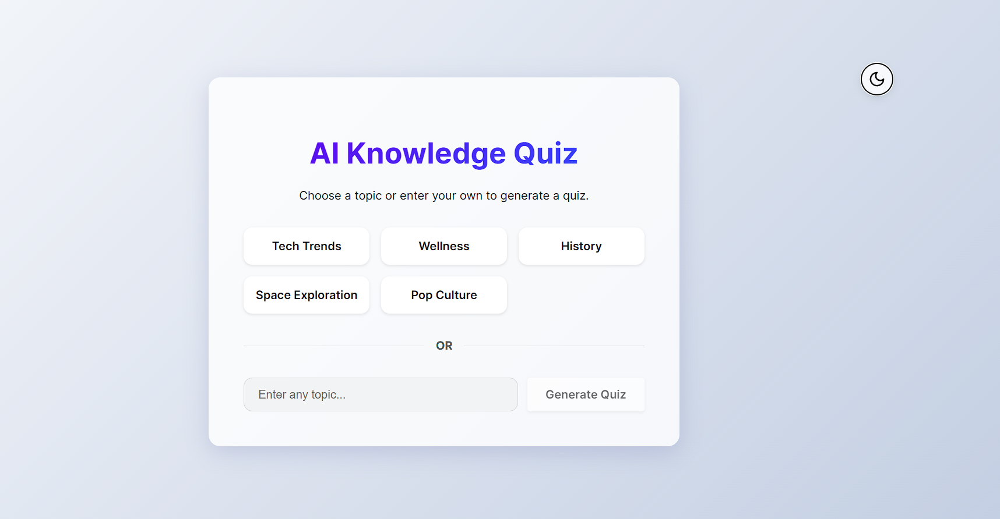
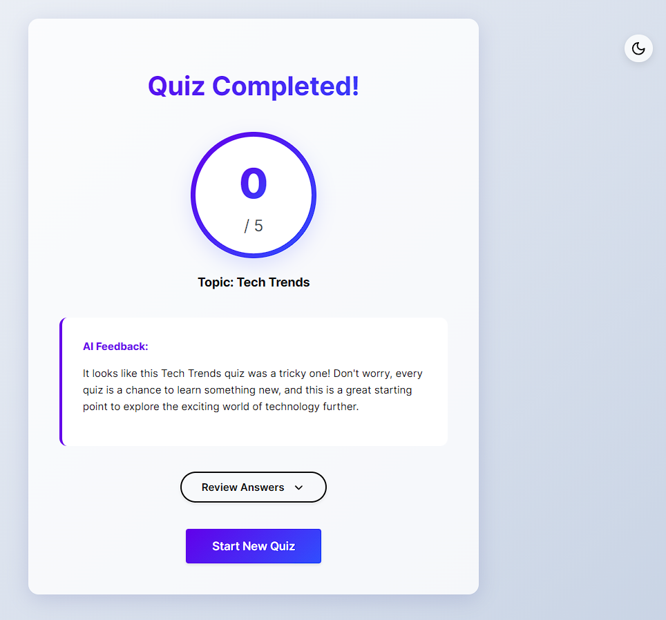

# AI-Powered Knowledge Quiz 🧠

A dynamic, AI-driven quiz application that generates questions on any topic you choose. Built with React, TypeScript, and Google's Gemini AI.

## 1. Project Setup & Demo

### Demo
[**Live Demo**](https://plum-assignment-brown.vercel.app/)

### Web Setup
Run the following commands to launch the project locally:

```bash
# 1. Clone the repository
git clone https://github.com/sachiny0106/Plum_assignment.git
cd Plum_assignment

# 2. Install dependencies
npm install

# 3. Configure Environment Variables
# Create a .env file in the root directory and add your Google Gemini API key:
# VITE_GOOGLE_API_KEY=your_api_key_here

# 4. Start the app
npm start
```
(Note: `npm start` is aliased to `vite` in this project).

Open [http://localhost:5173](http://localhost:5173) to view the app.

## 2. Problem Understanding

The goal was to create an interactive quiz application where the content (questions and feedback) is dynamically generated by AI based on a user-selected topic.

**Key Requirements:**
- **Topic Selection:** Allow users to choose or input a topic.
- **AI Generation:** Fetch 5 MCQs from an AI service.
- **Quiz Interface:** Navigate through questions, select answers, and track progress.
- **Feedback:** Provide a score and AI-generated personalized feedback upon completion.
- **Robustness:** Handle errors and ensure consistent data structure (JSON).

**Assumptions:**
- The application is built as a Single Page Application (SPA) using React and TypeScript.
- We are using Google's Gemini 2.5 Flash model for fast and cost-effective generation.

## 3. AI Prompts & Iterations

To ensure the AI returns consistent JSON that the app can parse, the following prompt structure is designed (and documented in `src/services/aiService.ts`):

### Question Generation Prompt
**Goal**: Get a strict JSON array of 5 questions.

**Initial Prompt Issues:**
Initially, the model would sometimes return conversational text ("Here are your questions...") before the JSON, or wrap the JSON in markdown code blocks, causing parsing errors.

**Refined Prompt:**
```text
Generate 5 multiple-choice questions about "${topic}".
Return ONLY the raw JSON response (no markdown formatting) in the following format:
[
  {
    "id": "unique_id",
    "text": "Question text",
    "options": [
      { "id": "a", "text": "Option A" },
      { "id": "b", "text": "Option B" },
      { "id": "c", "text": "Option C" },
      { "id": "d", "text": "Option D" }
    ],
    "correctOptionId": "id_of_correct_option",
    "explanation": "Brief explanation of why the correct answer is right"
  }
]
```

**Refinements Made:**
*   **"Return ONLY the raw JSON"**: Added to prevent conversational filler.
*   **JSON Structure Definition**: Explicitly provided the schema.
*   **Code Handling**: Added logic in `aiService.ts` to strip markdown code blocks if the model still includes them.

### Feedback Generation Prompt
**Goal**: Get a short, encouraging message based on the score.

**Prompt:**
```text
The user scored ${score} out of ${total} on a quiz about "${topic}".
Generate a short, encouraging, and personalized feedback message (max 2 sentences).
```

## 4. Architecture & Code Structure

The app follows a clean, component-based architecture using React and TypeScript.

*   **`App.tsx`**: The main controller. It manages the high-level state machine of the quiz (Topic Selection -> Loading -> Quiz -> Results).
*   **`services/aiService.ts`**: Encapsulates all interactions with the Google Gemini API. It handles prompt engineering, JSON parsing, and retry logic.
*   **`components/`**: Reusable UI components:
    *   `TopicSelection.tsx`: Handles user input for topics.
    *   `QuizLoader.tsx`: Shows loading state while AI generates content.
    *   `QuizDisplay.tsx`: Displays questions one by one with a progress bar.
    *   `Feedback.tsx`: Shows the final score and AI feedback.
*   **State Management**:
    *   **React `useState`**: Used for local component state and the main `QuizState`.
    *   **Context API**: Used for `ThemeContext` to manage global dark/light mode preferences.

## 5. Screenshots

### Topic Selection


### Quiz Interface


### Results & Feedback


## 6. Known Issues / Improvements

*   **AI Hallucinations**: Occasionally, the AI might generate a question with ambiguous options.
*   **Rate Limiting**: The free tier of Gemini API has rate limits. We implemented retry logic, but heavy usage might still hit limits.
*   **Improvement**: Add a timer for each question to increase difficulty.
*   **Improvement**: Save quiz history to local storage.

## 7. Bonus Work

*   **Dark/Light Mode**: Implemented a fully responsive theme switcher using React Context.
*   **Review Answers**: Added a feature to review incorrect answers with explanations after the quiz.
*   **Retry Logic**: Implemented automatic retries in `aiService.ts` to handle transient API failures.
*   **Progress Bar**: Visual indicator of quiz progress.

## 📝 License

MIT
